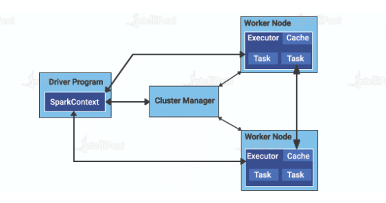
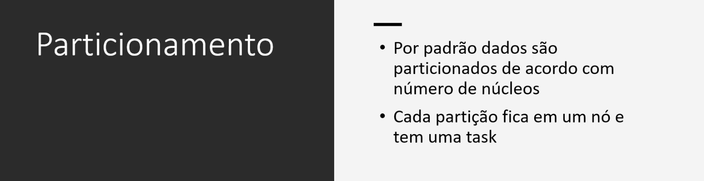
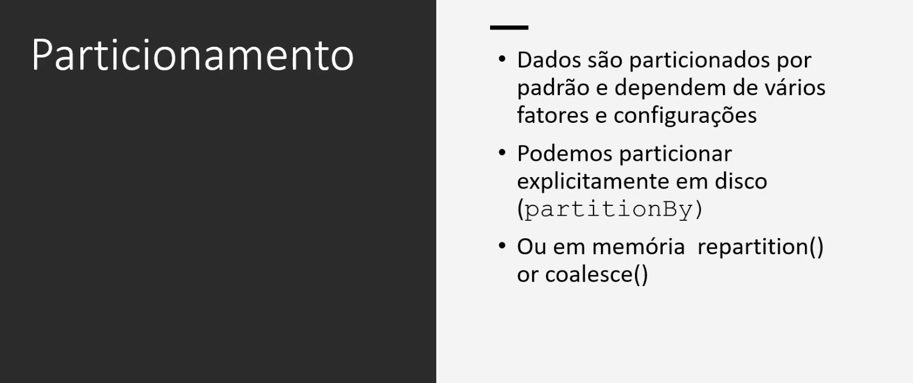
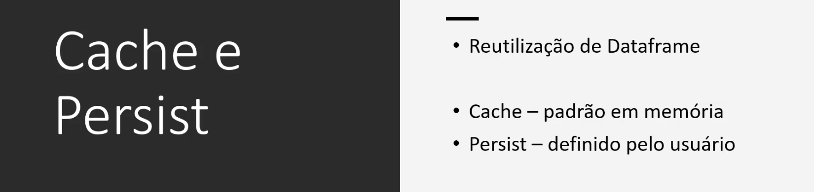
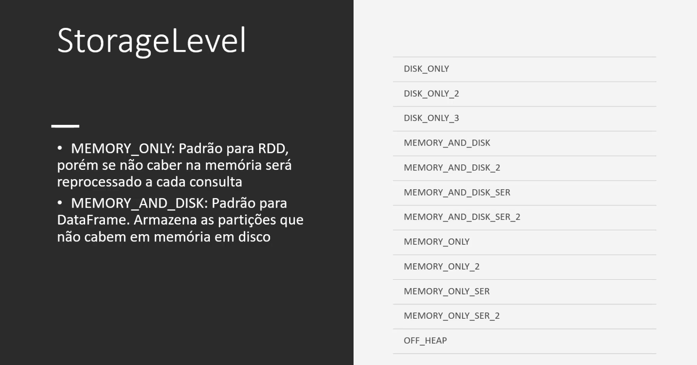

# Spark

## Alguns principais comandos PySpark:
[PySpark Cheat Sheet](https://www.globalsqa.com/pyspark-cheat-sheet/)

Spark é uma ferramenta para processamento de dados massivo.

No contexto do Apache Spark, um **cluster** é um conjunto de computadores interconectados que trabalham juntos para executar tarefas de processamento de dados. Cada computador no cluster é chamado de nó e pode executar várias tarefas de processamento em paralelo.

O Spark é projetado para distribuir tarefas de processamento em um cluster, dividindo os dados e as tarefas em partes menores e atribuindo essas partes a diferentes nós. Isso permite que o processamento seja realizado de forma rápida e eficiente, aproveitando o poder de processamento de vários computadores simultaneamente.

Um cluster geralmente é gerenciado por um software que coordena a comunicação entre os nós e divide as tarefas em partes menores que podem ser executadas simultaneamente em diferentes nós. Essa abordagem distribuída permite que o processamento seja feito de forma mais rápida e eficiente, uma vez que as tarefas podem ser executadas em paralelo.

Existem muitos tipos diferentes de clusters, desde pequenos clusters caseiros até grandes clusters de supercomputadores usados para executar cálculos complexos em áreas como pesquisa científica, inteligência artificial, análise de dados e muito mais.

**E as Threads?**

Para que consiga executar todos os comandos feitos pelo usuário, o processador precisa de instruções para manter tudo funcionando corretamente. Por isso, conta com a thread do processador, que significa basicamente uma ordem de tarefas a serem executadas pelo chip. Se você está com dúvidas sobre este termo técnico e quer saber mais sobre seu funcionamento, confira a seguir mais informações sobre o que é thread do processador e qual a sua importância no dispositivo.

Os processadores são os responsáveis pelo funcionamento e execução de todos os comandos do usuário para o computador. Essa é a parte fácil de entender sobre esses componentes. Porém, ao pesquisar por informações sobre os chips, é comum se deparar com vários termos técnicos que podem acabar complicando e gerando ainda mais dúvidas. Entre eles está a thread. Mas antes de explicar o que é thread do processador, primeiro é necessário entender o que são processos.

Quando você abre um aplicativo no seu computador, o sistema operacional entende o que está sendo feito e executa aquela ação. Após os softwares serem carregados, o processador começa o seu trabalho. Cada software funciona de uma determinada forma e para que o processador saiba exatamente o que fazer e quando fazer, todos eles possuem uma linha de instruções a serem executadas, os chamados processos. Essas instruções são o que vão garantir que aquela aplicação desejada pelo usuário, seja executada da forma adequada.

Agora que já entendemos um pouco melhor o que são processos, a thread é justamente a forma como o processador vai executar estas tarefas. A thread que recebe e executa todas as instruções, como uma ordem do que será feito por vez. É como um subsistema dentro do processador, onde os processos irão se dividir em duas ou mais tarefas. Essas tarefas são as threads ou linhas de execução.

Para entender melhor, cada núcleo é capaz de executar um programa ou tarefa por vez. Mas se você estiver com alguma outra aplicação aberta, ela também estará funcionando. Isso acontece pois mesmo que pareça estar acontecendo tudo ao mesmo tempo dentro de um computador, na real ele consegue executar apenas um processo por vez. As threads são o que organizam todos esses processos e essa sensação da realização das ações estarem acontecendo simultaneamente é devido a alta velocidade em que acontece essa troca na linha de execução.

Com a evolução dos processadores, começaram a surgir modelos dual-core, os que possuem dois núcleos, os quad-core com 4 núcleos e os octa-core, com 8 núcleos. Esses núcleos significam que cada um deles consegue executar uma aplicação de forma independente, ou seja, cada um funcionando como um processador de forma individual.

Portanto, cada núcleo desse também possui uma thread ou linha de execução. Também há os modelos multi-threads, que são aqueles que vem com mais de uma linha de execução para o mesmo núcleo. Isso significa mais potência para sua máquina, afinal, serão mais de um linha de execução trabalhando de forma individualizada em tarefas diferentes. Mas vale ressaltar que não são todos os processos que serão divididos em mais de um thread, assim como não são todos os núcleos que estarão funcionando ao mesmo tempo. Vai depender também de como cada software se comporta no processador. 

## Aplicações da Arquitetura Spark

Vamos entender os componentes de alto nível que fazem parte da arquitetura do aplicativo Apache Spark:

### O Spark Driver
O Spark Driver é como o banco do motorista de um aplicativo Spark. Ele atua como o controlador da execução de um aplicativo Spark. O driver Spark mantém todos os estados do aplicativo em execução no cluster Spark. Para obter recursos físicos e executar executores, o driver Spark deve ter interface com o gerenciador de cluster.

## Os executores Spark
As tarefas atribuídas pelo driver Spark são executadas pelos executores Spark. A principal responsabilidade de um executor do Spark é pegar as tarefas atribuídas, executá-las e relatar seu estado de sucesso ou falha e resultados. Cada aplicativo Spark tem seus próprios processos executores separados.

## O gerenciador de clusters
O gerenciador de cluster mantém um cluster de máquinas que executarão aplicativos Spark. Ele tem seu próprio driver chamado abstrações “master” e “worker”. Eles estão vinculados a máquinas físicas em vez de processos como no Spark.

A máquina, se você observar à esquerda da ilustração da arquitetura Spark, é o Cluster Manager Driver Node. Os círculos são os processos daemon que estão executando e gerenciando todos os nós de trabalho individuais. Estes são apenas os processos do Cluster Manager. Durante esse período, nenhum aplicativo Spark está em execução.

Quando chega a hora de executar um aplicativo Spark, os recursos são solicitados ao gerenciador de cluster para executá-lo. Dependendo da configuração do aplicativo, pode ser um local para executar o driver Spark ou simplesmente recursos para os executores do aplicativo Spark.

Ao longo da execução do aplicativo Spark, o Cluster Manager gerencia as máquinas subjacentes nas quais o aplicativo está sendo executado.

---

---

## Particionamento

É possível particionar o processamento em diferentes clusters. Isso ajuda quando há muitos registros para processar. É basicamente dividir os dados em partições (mês a mês, por exemplo).

---

## Lazy Evaluation

O spark utiliza Lazy Evaluation. Isso significa que uma transformação de dados só executada quando uma ação é invocada.

---

## Transformações: Narrow e Wide

Transformação Narrow ocorre quando os dados necessários estão em uma mesma partição.

Já Wide quando os dados estão em mais de uma partição.

## Componentes

---

## SparkContext e SparkSession

SparkContext fornece conexão transparente com o Cluster. Já o SparkSession dá acesso ao SparkContext

## Formato de dados para Big Data

---

## RDD - Reilient Distributed Datasets

---

## Dataset e DataFrame

---

---

---

---

## Spark SQL

---

---

---

---

---

## Streaming de dados

---

---

---
## Exemplos práticos de utilização de processamento em Streaming

---

---

---

---

## Particionamento

---

---

---

### Cache ou Persist

---

