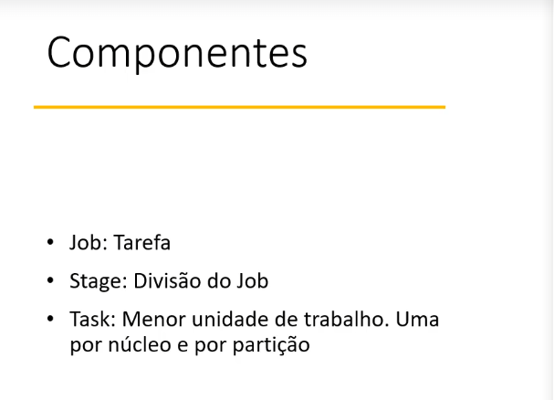
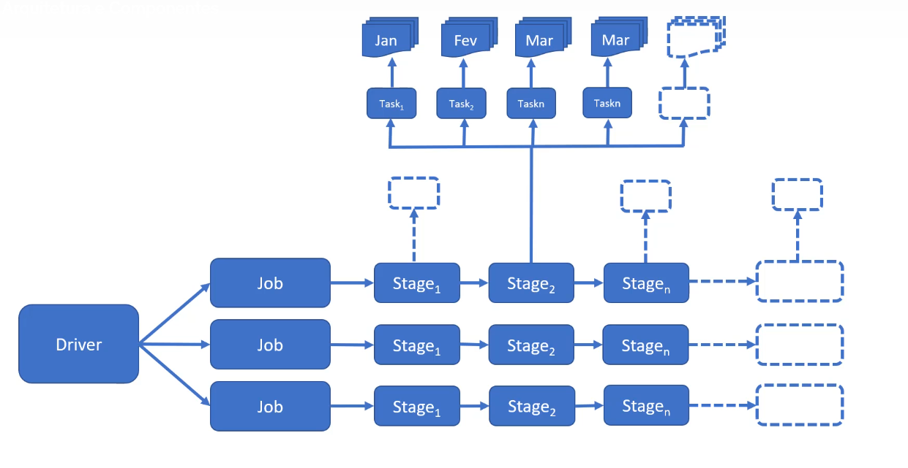
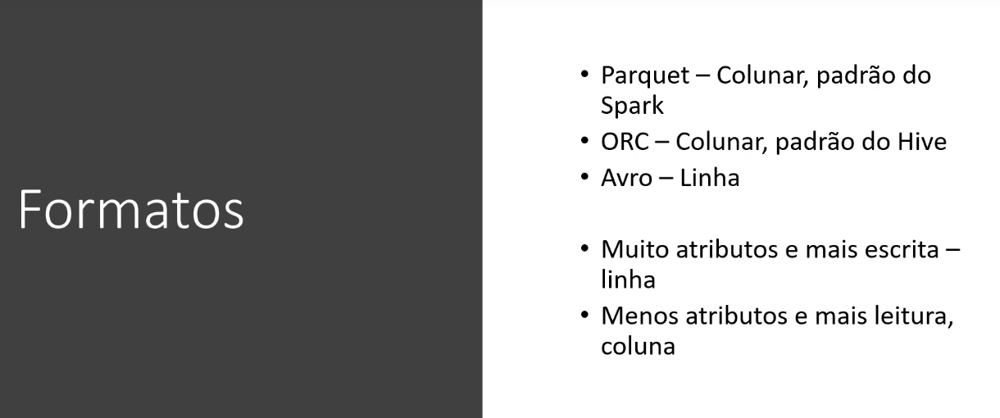
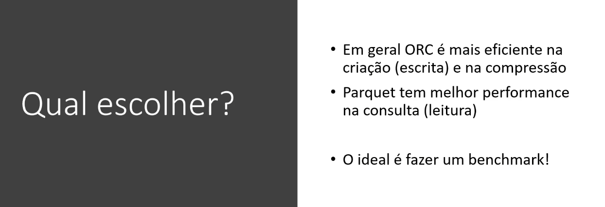

# Spark

Spark é uma ferramenta para processamento de dados massivo.

Ele trabalha com clusters, ou seja, o processamento pode ser dividido em várias máquinas. Graças a isso, ele é extremamente rápido e eficiente.

## Particionamento

É possível particionar o processamento em diferentes clusters. Isso ajuda quando há muitos registros para processar. É basicamente dividir os dados em partições (mês a mês, por exemplo).

## Lazy Evaluation

O spark utiliza Lazy Evaluation. Isso significa que uma transformação de dados só executada quando uma ação é invocada.

## Transformações: Narrow e Wide

Transformação Narrow ocorre quando os dados necessários estão em uma mesma partição.

Já Wide quando os dados estão em mais de uma partição.

## Componentes

## SparkContext e SparkSession

SparkContext fornece conexão transparente com o Cluster. Já o SparkSession dá acesso ao SparkContext

## Formato de dados para Big Data

